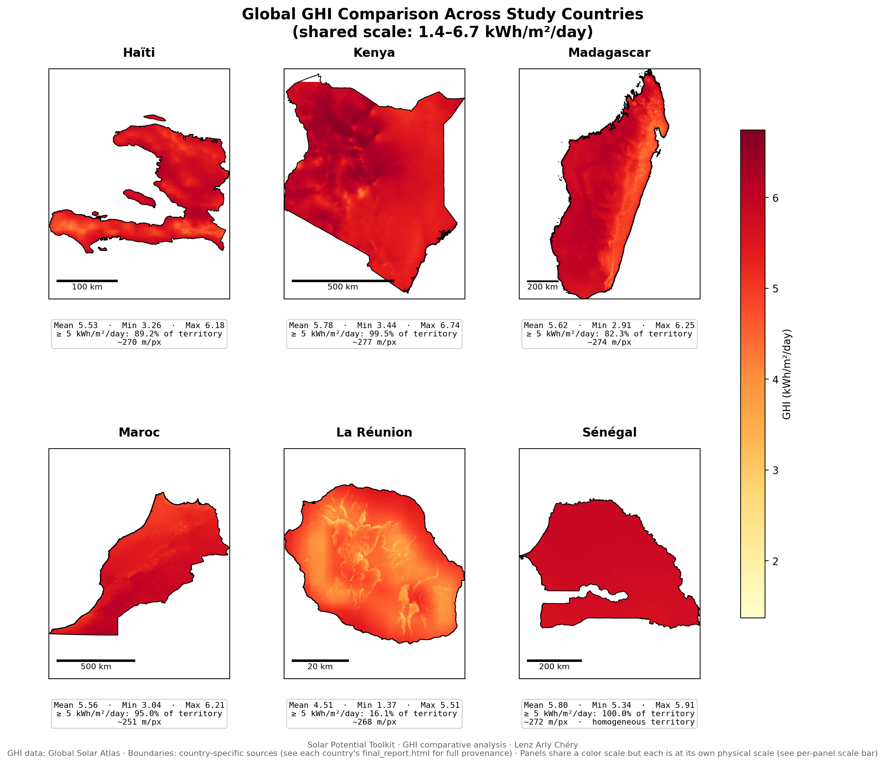
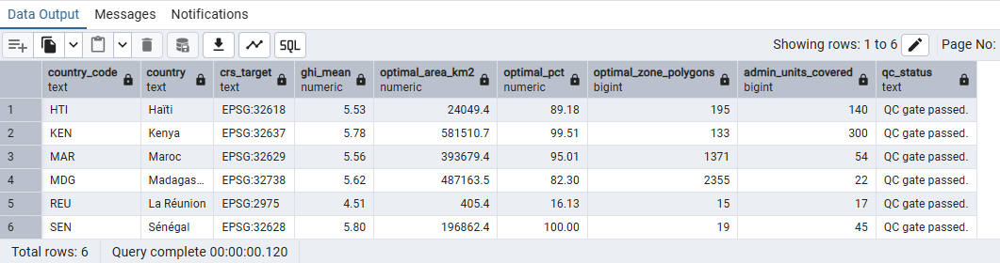
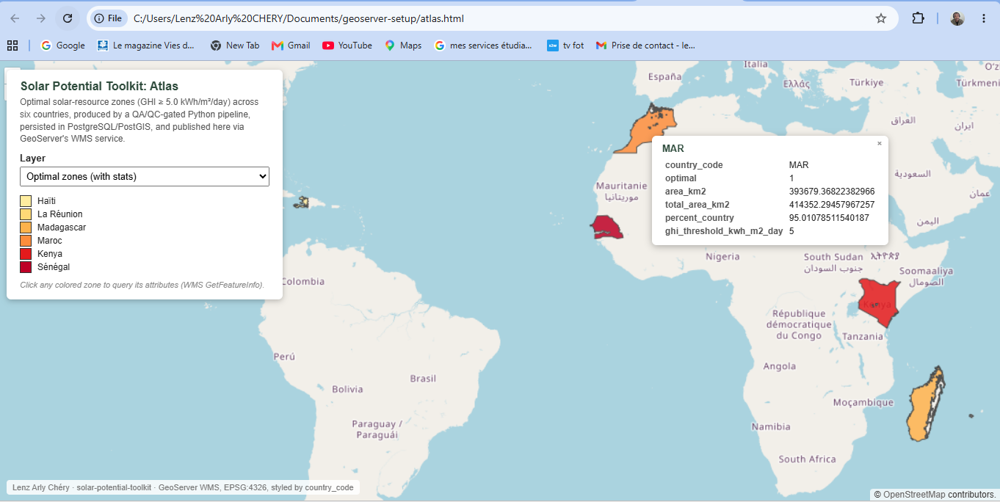

# ☀️ Solar Potential Toolkit

[](https://doi.org/10.5281/zenodo.22092959)
[](LICENSE)


**A reproducible, configuration-driven geospatial pipeline for assessing long-term solar resource and identifying favorable solar-resource zones across multiple countries, with built-in quality assurance and automated reporting.**

This repository provides a configuration-driven Python workflow for analysing Global Horizontal Irradiance (GHI) across multiple countries, identifying optimal solar zones relative to a given threshold, and producing per-country and cross-country scientific reports - all from a single, generic codebase driven entirely by `config/*.json` files.

<p align="center">
  
</p>

<p align="center">
<em>Global Horizontal Irradiance across the six countries currently configured in this toolkit - shared color scale, boundaries and summary statistics generated automatically by <code>04_global_report.py</code>.</em>
</p>

---

## 📑 Table of contents

- [Scientific context](#-scientific-context)
- [Architecture](#️-architecture)
- [Supported countries](#-supported-countries)
- [Repository structure](#️-repository-structure)
- [Data sources](#️-data-sources)
- [Methodology and scripts](#️-methodology-and-scripts)
- [Installation](#-installation)
- [Configuration](#-configuration)
- [Usage](#️-usage)
- [Outputs](#-outputs)
- [Reproducibility](#-reproducibility)
- [Database export](#️-database-export-optional)
- [Methodological note](#-methodological-note-reproducibility-across-raster-reprojection-methods)
- [Limitations](#️-limitations)
- [Citation](#-citation)
- [License](#-license)
- [Acknowledgments](#-acknowledgments)
- [References](#-references)

---

## 📚 Scientific context

This toolkit generalizes the single-country workflow developed for the reunion-solar-analysis repository (part of a Master's thesis on solar cooking feasibility at Université Paris-Saclay) - data ingestion, reprojection, and spatial analysis - into a reusable, multi-country pipeline. It was built to answer a practical question: **can this methodology be applied to a new country by writing a configuration file alone, without touching the processing code?**

Answering that question in the affirmative, across six countries with deliberately different characteristics, is what motivated most of this toolkit's additional machinery beyond the original three-script workflow: a two-phase QA/QC module, raster-based zonal statistics for scalability, and automated per-country and cross-country reporting - none of which existed in reunion-solar-analysis.

This toolkit characterizes spatial **suitability**, not demonstrated **feasibility** on any given day: the GHI threshold identifies zones with favorable long-term solar-resource conditions, not a guarantee that solar cooking succeeds above it or fails below it. Day-to-day outcomes depend on additional factors (cloud cover, cooker design, time of use) that are outside this toolkit's scope.

---

## 🏗️ Architecture

```text
config/<country>.json
         │
         ▼
   DATA INGESTION
         │
         ▼
   QA/QC (pre-processing) ──────────┐
   CRS declared, geometry           │
   validity, physical               │
   plausibility, CRS/pixel          │
   plausibility                     │
         │                          │ (--strict-crs)
         ▼                          ▼
   PREPROCESSING              STOP (on CRS/pixel
   (reproject + clip)          plausibility failure)
         │
         ▼
   QA/QC (post-processing)
   Boundary/raster area
   consistency, resolution
   consistency, admin
   topology, threshold
   plausibility
         │
         ▼
      ANALYSIS
   (GHI distribution,
    optimal zones)
         │
         ▼
     REPORTING
   ┌─────┴─────┐
   ▼           ▼
per-country   cross-country
 reports      global report
(JSON + HTML)  (JSON + HTML +
               comparative map)
         │
         ▼
   DATABASE EXPORT (optional)
   05_export_database.py
   Gated on the QC report's
   CRS/pixel plausibility -
   refuses to run otherwise
```

QA/QC checks run in two distinct phases, not as a single upfront gate. Input-validation checks (CRS declaration, geometry validity, physical plausibility, CRS/pixel plausibility) run before any transformation, on the raw input data. Consistency checks that require the already-reprojected and clipped raster to exist (boundary/raster area consistency, resolution consistency, admin topology, threshold plausibility) run after `01_reproject_clip.py`. The `--strict-crs` option only enforces the pre-processing phase's CRS/pixel plausibility result - see [QA/QC checks](#qaqc-checks) below for the full breakdown of which check runs in which phase.

The pipeline never re-runs processing to build a report: `utils/reporting.py` only reads artifacts (`ghi_statistics.csv`, `optimal_solar_zones_area.csv`, `qc_report.json`) already written to disk by earlier steps - reporting is a pure post-processing layer.

---

## 🌍 Supported countries

| Country | Admin level | Admin unit count | CRS | Vector source |
|---|---|---|---|---|
| Haïti | ADM2 (Commune) | 140 | EPSG:32618 | OCHA Haiti / CNIGS (via HDX), CC BY-IGO |
| La Réunion | ADM2 (Commune) | 24 | EPSG:2975 | GADM v2.8, academic/non-commercial |
| Madagascar | ADM2 (District) | 22 | EPSG:32738 | GADM v4.1, academic/non-commercial |
| Maroc | ADM2 | 54 | EPSG:32629 | GADM v4.1, academic/non-commercial |
| Kenya | ADM2 | 300 | EPSG:32637 | GADM v4.1, academic/non-commercial |
| Sénégal | ADM2 | 45 | EPSG:32628 | GADM v4.1, academic/non-commercial |

Adding a country requires a new `config/<country>.json` plus the corresponding raster and administrative vector files placed under `data/raster/` and `data/vectors/` - see [Configuration](#-configuration) below. No script (`00`-`04`) needs to be modified regardless of which country is added.

> **Data vintage note.** Administrative boundaries in this toolkit come from different providers and reference years: GADM v2.8 (2015, Réunion), GADM v4.1 (Madagascar, Maroc, Kenya, Sénégal), and OCHA/CNIGS COD-AB (reviewed January 2025, Haïti). Any cross-country reading of boundary-dependent figures should account for this rather than treat it as a purely geographic signal - see the global report's automatically generated heterogeneity note.

> **Raster reprojection note.** Five of the six countries (Haïti, Madagascar, Maroc, Kenya, Sénégal) use the raw Global Solar Atlas raster (WGS84) as downloaded, reprojected in-pipeline by `01_reproject_clip.py` via `rioxarray`'s `.rio.reproject()`. **La Réunion is the one exception**: `data/raster/GHI_Reunion.tif` in this repository is the same raster already reprojected to EPSG:2975 in QGIS, kept here deliberately for continuity with how this raster was originally prepared for this workflow. This is intentional, not an oversight - but it means Réunion's raster is in a different reprojection state than the other five countries in this toolkit, with a measured effect on the optimal-zone figure. See the [methodological note](#-methodological-note-reproducibility-across-raster-reprojection-methods) below for the quantified difference and what to expect if you substitute the raw, as-downloaded Réunion raster instead.

---

## 🗂️ Repository structure

```text
solar-potential-toolkit/
│   .gitignore
│   CITATION.cff
│   LICENSE
│   README.md
│   requirements.txt
│   verify_database.sql
│
├───env
│       .env                   <- gitignored, never committed - your real credentials
│       .env.example           <- tracked; template to copy
│
├───config
│       haiti.json
│       reunion.json
│       madagascar.json
│       maroc.json
│       kenya.json
│       senegal.json
│
├───data
│   ├───raster                 <- not tracked; see data/raster/README.md
│   └───vectors                <- not tracked; see data/vectors/README.md
│
├───figures                    <- static assets for this README (maps + DB/OGC screenshots)
│       GHI_Comparative_Grid.png
│       database_export_summary.png
│       geoserver_wms_openlayers.png
│
├───outputs                    <- regenerated by the pipeline, not tracked
│   ├───<country_code>
│   │   ├───maps
│   │   ├───tables
│   │   └───reports
│   └───global
│       ├───maps
│       └───reports
│
├───scripts
│       00_inspect_data.py
│       01_reproject_clip.py
│       02_ghi_distribution.py
│       03_optimal_zones.py
│       04_global_report.py
│       05_export_database.py
│       config_loader.py
│       run_pipeline.py
│
└───utils
        __init__.py
        qc.py
        mapping.py
        reporting.py
        database.py
```

---

## 🛰️ Data sources

| Source | Description | License | Access |
|---|---|---|---|
| **Global Solar Atlas 3.0** (World Bank Group / Solargis) | Daily average Global Horizontal Irradiance (GHI), ~250 m resolution, 1999–2018 | CC BY 4.0 | `https://globalsolaratlas.info/download/<country>` |
| **GADM v2.8 / v4.1** | Administrative boundaries (Réunion: v2.8; Madagascar, Maroc, Kenya, Sénégal: v4.1) | Academic and non-commercial use only; redistribution requires prior permission | `https://gadm.org` |
| **OCHA / CNIGS, via HDX** | Haiti Subnational Administrative Boundaries (COD-AB) | CC BY-IGO | `https://data.humdata.org/dataset/cod-ab-hti` |

Global Solar Atlas GHI values are long-term daily averages computed over 1999–2018, not observations from any individual day. Strictly speaking, GHI denotes an instantaneous irradiance (W/m²); the values used throughout this toolkit and reported in kWh/m²/day are daily irradiation totals (energy per unit area per day). The "GHI" label follows the Global Solar Atlas's own product naming rather than asserting strict unit equivalence.

Full per-country provenance (exact dataset, version, source URL, license) is recorded in `config/<country>.json` under `"provenance"`, and reproduced automatically in each country's `final_report.html`. Note that the Global Solar Atlas raster for **Réunion is not the raw download** - see the [Raster reprojection note](#-supported-countries) above.

---

## ⚙️ Methodology and scripts

The default GHI threshold (`ghi_threshold_kwh_m2_day`, 5.0 kWh/m²/day in every currently configured country) is used as an operational criterion to identify areas with favorable solar-resource conditions for solar cooking. This value is consistent with values discussed in the solar-cooking literature, but is not treated as a strict physical limit for cooking feasibility. The threshold is configurable per country in `config/<country>.json` and is not hard-coded in any script.

| Script | Role |
|---|---|
| `config_loader.py` | Loads and validates `config/<country>.json`, resolves all paths, exposes a typed `CountryConfig` |
| `00_inspect_data.py` | Runs the QA/QC checks available at the current processing stage and prints a reprojection decision summary |
| `01_reproject_clip.py` | Reprojects (if needed) and clips the GHI raster to the country's administrative extent |
| `02_ghi_distribution.py` | Descriptive GHI statistics and spatial-distribution map |
| `03_optimal_zones.py` | Extraction of zones ≥ threshold, vectorization, per-admin-unit zonal statistics, map |
| `04_global_report.py` | Cross-country comparative report from every already-processed country |
| `run_pipeline.py` | Orchestrates `00`–`03` for one or all countries, including both QA/QC phases, with optional strict CRS gating and reporting |
| `utils/qc.py` | Quality-control module: CRS/pixel plausibility, physical plausibility, resolution consistency, boundary/raster area consistency, admin topology, threshold plausibility |
| `utils/mapping.py` | Adaptive, collision-free label and marker placement, fully driven by `config/<country>.json` |
| `utils/reporting.py` | Reads already-produced artifacts and assembles per-country and global JSON/HTML reports |

### QA/QC checks

| Check | Phase | Purpose |
|---|---|---|
| Raster/vector CRS | Pre-processing | Confirms a CRS is declared |
| CRS/pixel plausibility | Pre-processing | Detects a CRS assigned via `write_crs()` where `reproject()` was actually needed, by comparing the raster's bounds (reconverted to WGS84) against the declared CRS's official area of use |
| Finite pixel values (full raster vs. territory) | Pre-processing | Distinguishes a raster's bounding-box coverage (often low, expected) from its actual territory coverage (the scientifically meaningful figure) |
| Geometry validity | Pre-processing | Detects invalid/self-intersecting polygons in the administrative layer |
| Raster/vector spatial compatibility | Pre-processing | Confirms real spatial overlap and coverage percentage |
| GHI physical plausibility | Pre-processing | Flags GHI values outside a physically plausible range |
| Resolution consistency | Post-processing | Flags a distorted pixel grid - often a sign the raster was reprojected outside this pipeline (e.g. in GIS software), producing a different output grid than `.rio.reproject()` would |
| Boundary/raster area consistency | Post-processing | Cross-checks the administrative boundary's geometric area against the raster-derived area, once the raster is actually in a projected CRS (meters) |
| Admin unit topology | Post-processing | Detects overlapping/duplicated polygons via an O(n) area comparison (sum of individual areas vs. dissolved union) |
| Threshold plausibility | Post-processing | Flags a GHI threshold sitting too close to a territory's observed min/max (near-total or near-empty optimal coverage) |

`--strict-crs` (requires `--check`) turns a pre-processing CRS/pixel plausibility failure into a hard stop; all other checks remain diagnostic (WARNING), continuing the pipeline while surfacing the issue in the report. **A higher warning count is not itself a quality score**: a run producing more warnings than another is not necessarily "worse" - each warning must be read against the specific check and phase that raised it. The Réunion investigation in the [methodological note](#-methodological-note-reproducibility-across-raster-reprojection-methods) below is a concrete example: an extra resolution-consistency warning there turned out to be informative evidence toward a root cause, not a defect to suppress.

### Scalability note

Per-admin-unit optimal-zone area is computed via **raster-based zonal statistics** (`rasterio.features.rasterize` + `numpy.bincount`), not via a vector/vector intersection (`geopandas.overlay`). A full geometric intersection scales with the complexity of the optimal-zone geometry, which can explode for a large, near-total-coverage country - this is a standard technique in geospatial pipelines (equivalent to QGIS's Zonal Statistics or GRASS's `r.stats`), adopted here after this exact failure mode was observed on a large-country test case.

---

## 💻 Installation

```bash
git clone https://github.com/lenzchery/solar-potential-toolkit.git
cd solar-potential-toolkit

conda create -n solar_toolkit python=3.11
conda activate solar_toolkit

conda install -c conda-forge geopandas rasterio rioxarray gdal pyogrio scipy

pip install -r requirements.txt
```

Database export (optional - see [Database export](#️-database-export-optional) below) additionally requires `sqlalchemy`, `psycopg2`, and `python-dotenv`, listed in `requirements.txt`.

---

## 🔧 Configuration

Each country is defined entirely by `config/<country>.json`: file paths, target CRS, GHI threshold, map styling (labels, markers, annotations), administrative unit metadata, and data provenance. Adding a new country requires a config file plus its raster and vector inputs in the right place under `data/` - never any change to `scripts/` or `utils/`.

Minimal example (`config/senegal.json`, trimmed for readability - see the actual file for the full `plot` and `provenance` blocks):

```json
{
  "country": "Sénégal",
  "country_code": "SEN",
  "crs_target": "EPSG:32628",
  "raster_filename": "GHI_Senegal.tif",
  "admin_vector_filename": "gadm41_SEN_2.shp",
  "admin_name_field": "NAME_2",
  "ghi_threshold_kwh_m2_day": 5.0,
  "plot": {
    "vmin": 5.3,
    "vmax": 6.0,
    "labels": { "max_labels": 10 }
  }
}
```

See any file already in `config/` as a complete, working template.

---

## ▶️ Usage

```bash
# Inspect and validate a country's inputs before processing
python scripts/00_inspect_data.py --country haiti

# Run the full pipeline for one country
python scripts/run_pipeline.py --country haiti

# Run with QC gating (abort on QC errors)
python scripts/run_pipeline.py --country haiti --check

# Run with strict CRS/pixel plausibility enforcement
python scripts/run_pipeline.py --country haiti --check --strict-crs

# Run and generate per-country reports
python scripts/run_pipeline.py --country haiti --check --report

# Run every configured country
python scripts/run_pipeline.py --all --check --strict-crs --report --keep-going

# Generate the cross-country comparative report
python scripts/04_global_report.py

# Export a country's already-produced artifacts to PostgreSQL/PostGIS
# (requires .env - see .env.example - and refuses to run if the QC
# report shows a CRS/pixel plausibility issue)
python scripts/05_export_database.py --country haiti

# Export every configured country to the database
python scripts/05_export_database.py --all
```

---

## 📊 Outputs

Per country (`outputs/<code>/`): `maps/Final_GHI_Distribution_Map.png`, `maps/Optimal_Solar_Zones.png`, `tables/ghi_statistics.csv`, `tables/optimal_solar_zones_area.csv`, `reports/qc_report.json`, `reports/processing_report.json`, `reports/final_report.html`.

Cross-country (`outputs/global/`): `maps/GHI_Comparative_Grid.png` (shared color scale, derived from actually observed data across all processed countries, with national boundaries and per-country statistics), `reports/global_report.html`, `reports/global_report.json`.

---

## 🔁 Reproducibility

`outputs/` and `data/raster/`, `data/vectors/` (beyond their `README.md`) are not version-controlled - see `.gitignore`. Rerunning `scripts/run_pipeline.py` locally reproduces every result from the tracked source code and configuration alone. `data/raster/README.md` and `data/vectors/README.md` document exactly where to obtain each country's raw inputs - **with the exception of Réunion's raster, which requires the QGIS-reprojected version, not the raw Global Solar Atlas download, to reproduce this repository's published figures exactly (see below).**

---

## 🗄️ Database export (optional)

The toolkit can optionally export a country's already-produced artifacts to PostgreSQL/PostGIS via `scripts/05_export_database.py`. Like `04_global_report.py`, this is a pure post-processing step: it never re-runs QC, reprojection, or analysis, and reads only what `01`-`03` already wrote to `outputs/<code>/`.

**QC-gated ingestion.** Export refuses to run for a country whose `qc_report.json` shows `qc_status == ERROR`, was never executed at all (`qc_executed == false`), or shows a CRS/pixel plausibility issue in its errors (see [`utils/database.py`](utils/database.py)'s `check_qc_gate()`). A spatial product whose CRS declaration is inconsistent with its geographic extent must never enter the database - the same principle already enforced by `--strict-crs` earlier in the pipeline, now extended to the persistence layer. This gate does not require every diagnostic warning across all ten QA/QC checks to be clear (see the [QA/QC checks](#qaqc-checks) note above on why a warning is not itself a failure) - it specifically checks for an execution failure, a QC error status, or a CRS/pixel plausibility problem.

**Idempotent per country, not an audit log.** Re-running the export for a country deletes that country's existing rows in every table, inside a transaction, before inserting the fresh ones. Running the export twice for the same country never accumulates duplicate or stale rows - a deliberate choice for the current experimental/development phase, where the same country is re-processed and re-exported repeatedly while the pipeline is being tuned. This is a "last write wins per country" design, not a history of every run: re-exporting a country after a config change (e.g. a different threshold) replaces its previous rows rather than keeping both. If a full run history is needed later, a `run_id` would need to be added to the delete/insert key instead of `country_code` alone. **Verified**, not just intended: `--all` was run twice back to back on the full six-country set - once after dropping every `solar.*` table, once without dropping anything first - and both runs produced identical row counts with zero duplicates (see the idempotency check queries in [`verify_database.sql`](verify_database.sql)). This confirms the mechanism behaves as designed; it does not change what the design itself keeps or discards (see [Limitations](#️-limitations) below).

**Config/database synchronization, not just per-country idempotency.** The delete-then-insert above is scoped to whichever country `export_country()` is called for - it never touches rows for a country that has simply stopped being passed in. On `--all`, `utils/database.py`'s `sync_database_to_configs()` closes that gap: after exporting every currently-configured country, it compares each managed table's distinct `country_code` values against the countries still present in `config/*.json`, and deletes any row whose country is no longer configured. Without this step, a country temporarily added to `config/` and later removed would leave stale rows in the database indefinitely, since nothing else in the pipeline would ever be told to clean them up.

**Extensibility test.** To verify config-driven extensibility end to end - not just for the raster/vector pipeline (`00`–`04`) but for the database layer as well - three additional countries (Angola, Gabon, Uganda) were temporarily added via `config/*.json` only, exported successfully alongside the six countries above, then removed:

```bash
# Add config/angola.json, config/gabon.json, config/uganda.json
python scripts/run_pipeline.py --all --check --report
python scripts/05_export_database.py --all
# -> 9/9 countries exported, no code changes required

# Remove the three temporary configs
python scripts/05_export_database.py --all
```

The second `--all` run produced:

```
Database sync: removed stale country rows -> {
    'ghi_statistics': ['AGO', 'GAB', 'UGA'],
    'optimal_zones_area': ['AGO', 'GAB', 'UGA'],
    'optimal_zones': ['AGO', 'GAB', 'UGA'],
    'admin_centroids': ['AGO', 'GAB', 'UGA'],
    'artifact_catalog': ['AGO', 'GAB', 'UGA'],
    'processing_runs': ['AGO', 'GAB', 'UGA']
}
```

confirming that all six managed tables - not just one - were correctly synchronized back down to the six countries still present in `config/`, with no manual cleanup and no leftover rows.

**What is stored where.** Tabular and vector artifacts (GHI statistics, optimal-zone areas and geometries, admin centroids, run metadata) are written directly to PostgreSQL/PostGIS tables. The clipped raster and the PNG/HTML outputs are **not** embedded in the database in this version - they are cataloged as file paths in an `artifact_catalog` table, keeping the database as a queryable index while large binary artifacts stay on the filesystem. Importing the raster itself via PostGIS Raster is a possible future extension, not implemented here.

**Storage CRS.** All geometry tables (`optimal_zones`, `admin_centroids`) are shared across countries, but each country's own outputs are in a different local projected CRS (`cfg.crs_target` - e.g. EPSG:32618 for Haïti, EPSG:32637 for Kenya). A PostGIS geometry column has a single fixed SRID, set at table creation, so every geometry is reprojected to **EPSG:4326 (WGS84)** before being written - the standard choice for a country-agnostic canonical storage CRS. This only affects how geometries are stored; the area/statistics tables (`ghi_statistics`, `optimal_zones_area`) are unaffected, since those figures were already computed upstream in each country's local projected CRS and are stored as plain numbers, not geometries. Use `ST_Transform(geom, <target_srid>)` in SQL to reproject back to a local CRS for any query that needs accurate area or distance in meters. For the same reason, `admin_centroids` keeps only `admin_name` (via `cfg.admin_name_field`) and `zone_area_km2`, not each provider's raw attribute columns (e.g. GADM's `GID_2` vs. OCHA/CNIGS's fields for Haïti), which differ by country and would otherwise break the shared table's fixed schema.

**Independent cross-validation of stored areas.** The area figures stored in
`optimal_zones_area` (computed upstream in Python via `compute_area_stats()`)
were independently cross-checked by recomputing surface area directly in
SQL, from the stored geometries alone - `ST_Transform` to each country's
local projected CRS, then `ST_Area`, `GROUP BY country_code`. Both methods
agree to rounding precision across all six countries:

| Country | Python (`area_km2`) | SQL (`ST_Transform` + `ST_Area`) | Difference |
|---|---|---|---|
| Haïti | 24,049.44 | 24,049.44 | 0.0000 |
| Kenya | 581,510.75 | 581,510.75 | 0.0000 |
| Maroc | 393,679.37 | 393,679.37 | 0.0000 |
| Madagascar | 487,163.52 | 487,163.52 | 0.0000 |
| La Réunion | 405.39 | 405.39 | 0.0000 |
| Sénégal | 196,862.35 | 196,862.35 | 0.0000 |

This confirms the exported geometries are not just visually correct but
numerically consistent with the pipeline's own reported statistics - the
same validation discipline already applied to idempotency and config/database
synchronization above.

**Result, all six countries.** The query below - `solar.country_summary`, a view combining GHI statistics, optimal-zone coverage, and geometry counts per country - confirms the database export end to end: six countries present, one shared geometry SRID (EPSG:4326), each country's export gated on the QC report showing no execution failure and no CRS/pixel plausibility issue.

<p align="center">
  
</p>

<p align="center">
<em>Query result from <code>solar.country_summary</code> (see <a href="verify_database.sql">verify_database.sql</a>) - all six countries exported, one shared geometry SRID (EPSG:4326), each gated on a passed CRS/pixel plausibility check.</em>
</p>

Verification queries used to confirm the export (schema, row counts per country, SRID consistency, QC gate status) are collected in [`verify_database.sql`](verify_database.sql) - plain SQL, runnable in pgAdmin's Query Tool or any other PostgreSQL client (no psql-specific meta-commands).

**Credentials.** Supplied through environment variables via `python-dotenv`, never committed to the repository. This project keeps both files together in a dedicated `env/` subfolder rather than at the project root: `env/.env.example` (tracked) is the template, `env/.env` (gitignored - see `.gitignore`) holds your real local credentials. `utils/database.py` loads `env/.env` from an explicit path, since `python-dotenv`'s default discovery does not look inside subfolders.

**Prerequisite: PostGIS extension.** The target database must have PostGIS enabled - this is not automatic even when the PostGIS software is installed on the server. Run once, as a database owner/superuser: `CREATE EXTENSION IF NOT EXISTS postgis;`. Export fails fast with this exact instruction if it detects PostGIS is missing, rather than surfacing a cryptic error partway through.

```bash
cp env/.env.example env/.env
# edit env/.env with your local PostgreSQL/PostGIS credentials

python scripts/05_export_database.py --country haiti
```

### OGC publication (external, manual demonstration)

The unified EPSG:4326 storage CRS and gated, idempotent per-country tables make the exported database suitable for downstream OGC publication. GeoServer publication is demonstrated separately as an external manual step and is not part of the automated toolkit pipeline, but demonstrates that the exported geometries are directly usable by standard geospatial clients without any additional transformation. `optimal_zones_with_stats`, a GeoServer SQL view joining the geometry table to its corresponding statistics table by `country_code`, was published as a styled WMS layer (categorized by `country_code`), letting a standalone OpenLayers web map query full per-country GHI statistics interactively via WMS `GetFeatureInfo`:

<p align="center">
  
</p>

---

## 🔬 Methodological note: reproducibility across raster reprojection methods

Running this toolkit's Réunion pipeline on the same source raster and the same administrative vector, but in two different reprojection states, produces two different optimal-zone figures. This is a controlled, understood, and now deliberately documented characteristic of this toolkit's Réunion entry - not an unexplained bug.

**Controlled comparison.** The pipeline was run on Réunion in two configurations, with everything else held identical (code, config, administrative vector, threshold):

| Input raster | Optimal-zone area |
|---|---|
| Raw Global Solar Atlas raster (WGS84), reprojected in-pipeline via `rioxarray`'s `.rio.reproject()` | **392.1 km² (~15.6%)** |
| The same raster, pre-reprojected to EPSG:2975 in QGIS (the version historically used to prepare this raster for this workflow) | **405.40 km² (16.13%)** |

This isolates the discrepancy to the reprojection step itself, rather than to the area-computation logic (`compute_area_stats()` is unaffected by which raster state is provided) or to the administrative vector, which is identical in both runs.

**Root cause.** `.rio.reproject(target_crs)`, called without an explicit target resolution, computes its own output grid (origin and pixel size) from the transformed raster bounds - a grid that does not necessarily match the one QGIS's Warp tool produced when the raster was reprojected by hand. A separate, controlled resampling-method comparison (`reproject_match()`, which forces an identical output grid before testing `nearest`/`bilinear`/`cubic`/`lanczos`/`average`/`mode`) showed the resampling algorithm itself accounts for only a negligible difference (~0.02 kWh/m²/day mean pixel-value difference) once the grid is aligned. This confirms an **output grid/resolution mismatch**, not the choice of resampling method, as the primary driver of the discrepancy.

This grid mismatch is directly visible in the pipeline's own QC output: the pre-processing resolution-consistency check flags the QGIS-reprojected raster as anisotropic (`res_x=257.33 m` vs `res_y=279.03 m`, an 8.4% difference - WARNING), i.e. non-square pixels. The same check passes trivially on the raw, unprojected raster, since at that point in the pipeline it is evaluating the source WGS84 grid (0.0025° × 0.0025°, isotropic by construction) - this pre-processing check always runs before 01_reproject_clip.py, so for every country it examines the raster as delivered, not any reprojection output the pipeline itself may or may not produce later. This is consistent with, and adds concrete evidence for, the grid-mismatch explanation above - the QGIS output grid and the pipeline's own reprojection grid are measurably different in shape, not just in origin.

A GHI threshold classification (`GHI ≥ 5.0`) is more sensitive to grid placement than a descriptive statistic like the mean, because even a small shift in where pixel boundaries fall can move pixels across the threshold near the zone's edge.

**Practical implication and design decision.** Because this discrepancy is understood and quantified, `data/raster/GHI_Reunion.tif` in this repository is deliberately kept as the QGIS-pre-reprojected raster (see the [Raster reprojection note](#-supported-countries) above), for continuity with how this raster was originally prepared. This makes Réunion the only country in this toolkit not reprojected in-pipeline like the other five - a deliberate, documented exception, not an oversight. If you substitute the raw, as-downloaded Réunion raster from Global Solar Atlas, expect **392.1 km² (~15.6%)** instead of 405.40 km² - this is expected, documented behavior, not an error.

This investigation was made possible by the pipeline's own QA/QC discipline: the two-phase QC design (see [Architecture](#️-architecture)) surfaced the raster's CRS/reprojection state as the first variable to control for in a controlled comparison, rather than defaulting to resampling method as an unverified assumed cause.

---

## ⚠️ Limitations

- CRS choices for multi-zone countries (Maroc, Kenya) are provisional single-projection approximations documented in each config's `_note` field; area/distance figures near a country's UTM zone boundary should be treated with appropriate caution.
- Administrative boundary vintage differs across countries (see [Supported countries](#-supported-countries)); cross-country comparisons of boundary-dependent figures should account for this.
- "Percentage of analyzed territory" is computed against the dissolved extent of the administrative vector layer used for a given run, not necessarily an official national area figure.
- Réunion's raster is in a different reprojection state than the other five countries (see the [methodological note](#-methodological-note-reproducibility-across-raster-reprojection-methods) above) - a deliberate, documented exception, not an inconsistency to be resolved silently.
- Database export (`05_export_database.py`) keeps only the latest export per country by design - re-exporting after any change (e.g. a different threshold) discards the previous rows rather than preserving them alongside the new ones. This has been verified to behave exactly as intended (zero duplicates or stale rows across repeated `--all` runs - see [Database export](#️-database-export-optional) above); the limitation is one of scope (no run history), not of reliability. A future `run_id`-based schema would be needed to keep every run as a separate, queryable record.
- The GeoServer/OGC publication described above is a manual demonstration outside this repository (a separate, non-versioned `geoserver-setup/` folder) - it is not reproducible by cloning this repository alone, and is not covered by any automated test.

---

## 📖 Citation

See [`CITATION.cff`](CITATION.cff) to cite this exact version (v1.0.0, DOI [10.5281/zenodo.22092960](https://doi.org/10.5281/zenodo.22092960)). The badge above always resolves to the latest release.

## 📄 License

See the [LICENSE](LICENSE) file (MIT for the code; datasets remain under their original licenses - see [Data sources](#-data-sources) above).

## ✍️ Author

**Lenz Arly Chéry**
Master 2 Développement Agricole Durable - Université Paris-Saclay (2024–2025)
GitHub: https://github.com/lenzchery

Foundational training in geomatics and remote sensing was acquired during the Master Risques Naturels des Environnements Tropicaux - Géomatique & Télédétection, Université de La Réunion (2022–2024).

## 🙏 Acknowledgments

The interest in solar resource assessment behind this toolkit traces back to a Master 1 research placement on the characterization of a direct solar cooker, supervised by **Guillaume Guimbretière**, then at CNRS / Laboratoire de l'Atmosphère et des Cyclones (LACy), Université de La Réunion, in 2023.

## 📚 References

- Global Solar Atlas. (2024). *Global Solar Atlas 3.0.* The World Bank Group / Solargis.
- Hijmans, R. J. *Global Administrative Areas (GADM).* https://gadm.org
- Muthusivagami, R. M., Velraj, R., & Sethumadhavan, R. (2008). Solar cookers with and without thermal storage - A review. *Renewable and Sustainable Energy Reviews*, 14(2), 691-701.
- OCHA Field Information Services Section. *Haiti - Subnational Administrative Boundaries.* Humanitarian Data Exchange. https://data.humdata.org/dataset/cod-ab-hti